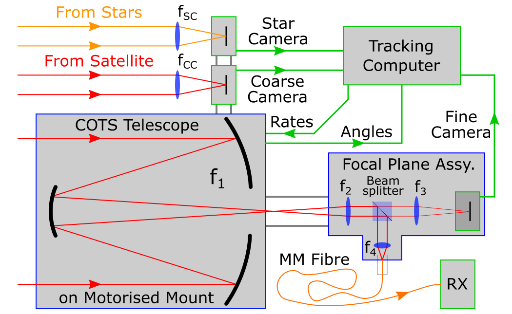
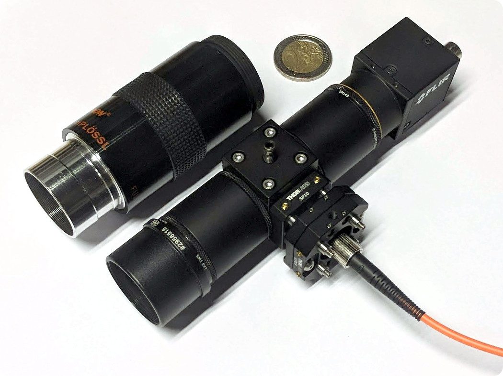

Focal Plane Assembly Build
==========================

You may build a ground station for use with pypogs, with the general architecture shown below:

   
This can be implemented without any modifications to your telescope by replacing the eyepiece of 
your telescope with a focal plane assembly (FPA) show below besides an eyepiece:   

   
The FPA costs less than 1000 euros (or dollars) to build (excl. the camera).
   
Parts needed
------------
All optomechanics and optics may be ordered from `ThorLabs <https://www.thorlabs.com/>`_ except
for the adapter to a telescope eyepice barrel. Your telescope vendor should have such an item.

Base items
^^^^^^^^^^

    - SC6W; 16 mm Cage Cube; 1pc
    - SM05CP2; SM05 End Cap; 1pc 
    - SPM2; Cage Prism Mount; 1pc
    - SB6C; Cube Clamp; 1pc
    - SR1-P4; Cage Rod, 1" Long, 4 Pack; 1pc
    - SSP05; XY Slip Plate; 1pc
    - SM05FC; FC/PC SM05 Fibre Adapter; 1pc \*
    - SM05A3; SM05 to SM1 Adapter; 2pc
    - SM1L10; SM1 Lens Tube, 1" Long; 1pc \*\*
    - SM1M10; SM1 Lens Tube w/o External Thread, 1" Long; 1pc \*\*\*
    - SM1A9; C-Mount to SM1 Adapter; 1pc 	
    - SM1A10; SM1 to C-Mount Adapter; 1pc

    | \* May change for fibre connector of your choosing.
    | \*\* May need to adjust length based on focal length `f3`.
    | \*\*\* May need to adjust length based on focal length `f2`.
    
Optics and mounts
^^^^^^^^^^^^^^^^^
For lenses `f2` and `f3` a lens with diameter 1" or less (1/2" recommended) may be used. For your
chosen lens diameter, get an appropriate `SM1A{...}` adapter from the category "Mounting Adapters
with Internal and External Threads".

For the lens `f4` a lens with diameter 12mm or less may be used (8mm recommended). For your chosen
lens diameter, get an appropriate `SP{...}` adapter from the category "16 mm Cage Plates for
Unmounted Optics".

The beam-splitter must be a 10mm cube. Thorlabs has a range of non-polarising beam-splitters with
reflection:transmission of 10:90, 30:70, 50:50, 70:30, 90:10. Typically 10% to the tracking camera
is fine.

A recommended setup would be:

    - SM1A6T; SM1 Adapter for 1/2" (SM05) Optic; 2pc (`f2` and `f3` mount) 
    - AC127-025-B; f=25mm, 1/2" Achromatic Doublet; 1pc (`f2`)
    - AC127-030-B; f=30mm, 1/2" Achromatic Doublet; 1pc (`f3`)
    - SP10; 16 mm Cage Plate for 8mm Optic; 1pc (`f4` mount)
    - AC080-010-B; f=10mm, 8mm Achromatic Doublet; 1pc (`f4`)
    - BS071; 90:10 (R:T) beam-splitter 10mm cube; 1pc

Extras
^^^^^^
It is recommended to get some glue (e.g. cyanoacrylate) to permanently bond the beam-splitter to the
cage prism mount for stability, and matte-black aluminium foil to shield the FPA from stray light.

Useful to rotate the camera:

    - CMSP025; C-Mount Spacer Ring, .25mm Thick; 1pc
    - CMSP050; C-Mount Spacer Ring, .5mm Thick; 1pc
    - CMSP100; C-Mount Spacer Ring, 1mm Thick; 1pc

Useful for building/aligning:

    - SPW602; Spanner Wrench for SM1; 1pc
    - SPW603; Spanner Wrench for SM05; 1pc
    - SR05-P4; Cage Rod, 1/2" Long, 4 Pack; 1pc
    - SCPA1; 16 mm Cage Alignment Plate; 1pc
    - CPS635R; Collimated Laser Module, 635 nm, 1.2 mW; 1pc
    - CPS11K(-EC); Ø11 mm Laser Diode Module Mounting Kit; 1pc
    - SP03; 16mm Cage Plate Clear Aperture; 1pc
    - MSP2(/M); Mini Pedestal Pillar Post; 1pc
    - MSC2; Mini Clamping Fork; 1pc 

Constuction
-----------
1. Add two SM05A3 adapters to opposite sides of your SC6W cage cube.
2. Add four SR1 rods to one side of your cage cube.
3. Glue your beam-splitter to the SPM2 mount and insert into cage cube (take care of orientation!).
4. Mount your camera to the SM1L10 lens tube with the SM1A9 adapter.
5. Mount your `f3` lens in its SM1A6T adapter (take care of orientation!) and place in lens tube.

    Optional for setting camera rotation:
    
    a. Attach the lens tube with the camera to the cage cube.
    b. Add CMSPxxx spacers as desired to rotate the camera.
    c. Remove the camera again and continue the steps.

6. Lock your `f3` lens in infinity focus (e.g. focus on something very far away) by rotating mount.
7. Mount the lens tube with the camera with SM05A3 adapter.
8. Mount your `f4` lens in its SP10 adapter (take care of orientation!).
9. Mount `f4` on the SR1 rods, flush with the cage cube, and lock in place.
10. Attach SM05FC fibre adapter in SSP05 slip plate and mount on the SR1 rods.
11. Attach a fibre and shine light from the opposite end. You will see reflections from the
    beam-splitter on your camera. Rotate the beam-splitter until the reflections overlap and adjust
    the slip plate position until a centered sharp image of the fibre face is seen.
12. Lock your beam-splitter rotation and add SB6C clamp, lighly pressing on the beam-splitter.
13. Mount your `f2` lens in its SM1A6T adapter (take care of orientation!) and place in SM1M10 lens
    tube. Attach to cage cube.
14. Fix position of `f2` such that primary focus is slightly outside the lens tube (i.e. all the way
    in to the lens tube).
15. Add SM1A10 adapter and your C-mount to telescope eyepiece barrel (e.g. 1.25").
16. Finish by adding SM05CP2 end cap in the unused hole.
