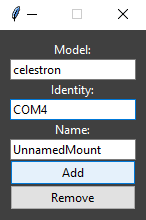
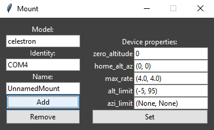
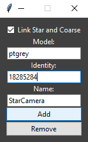
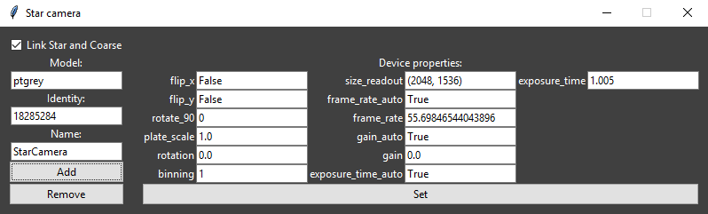
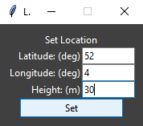
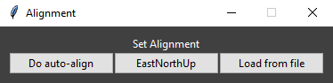
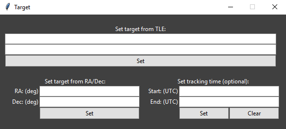
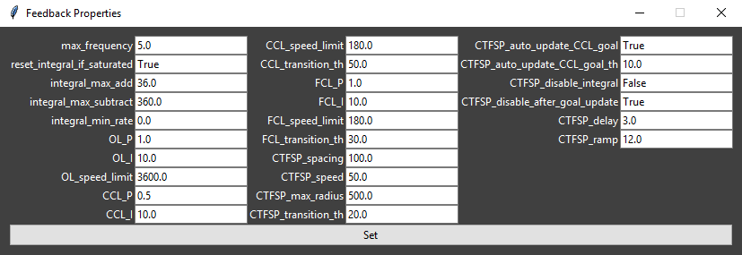
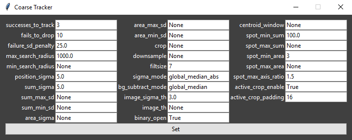
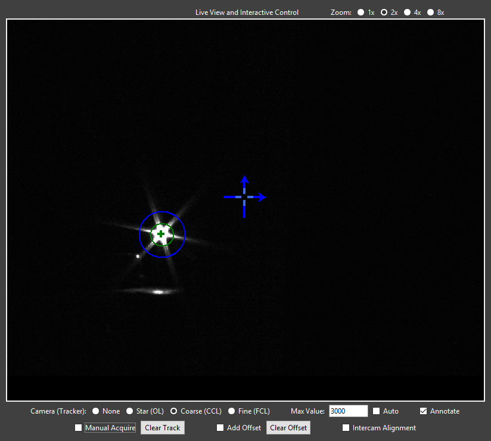

Graphical User Interface Guide
==============================
pypogs includes a simple yet powerful Graphical User Interface (GUI) to control a tracking session. 
It includes for example hardware setup, alignment, target selection and tracking, automatic or
manual closed-loop acquisition, and controlling all system parameters. A typical tracking scenario
may look as below:

.. image:: ./Figures/GUI_in_action.png
   :target: _images/GUI_in_action.png

Below, an explanation of the GUI features and functionality is presented. You may open an empty GUI
by going to the `examples` folder in a terminal/CMD window and typing::

    python run_pypogsGUI.py

Note that it is entirely possible (even recommended) to first load and set up pypogs using the API
before loading the GUI, to configure the system to your desires on startup. See the example file
`setupCLI_runGUI.py` for how this may be done (this is in particular the setup for ESA's test
system). To find appropriate settings to change for your system, however, it's a good idea to load
everything through the GUI and set it up as you like, then edit the mentioned example to those
settings.

Hardware Setup and Properties
^^^^^^^^^^^^^^^^^^^^^^^^^^^^^
Hardware is loaded and settings are controlled here. Clicking `Mount` will open this window:

   
Here, type the `Model` and `Identity` appropriate for the hardware device you want to add. See the
API documentation for specific allowed values. Clicking `Add` will connect to the device.

You should now see two things: 1) the `Mount` button in the main window says `Ready` and gets a 
green border; 2) the window changes to this:

   
Where you can now change the hardware settings. For the mount these are typically just left to 
default.

The cameras are added similarily, with one important distinction. When adding either coarse or star
camera a checkbox labelled `Link Star and Coarse` appears. Check this box if you are using the same
physical device as star and coarse cameras, see below:

After clicking add, it should change to:

   
Where now many important settings are available. In particular, *the camera plate scale must be
set correctly.*

Loading the other cameras and a receiver is straightforward, following the same procedure as above.

When you are done, all the hardware devices you wish to use should say `Ready` with green borders.

Manual Control
^^^^^^^^^^^^^^
Here you may send move commands to the telescope mount. There are three coordinate systems
available to choose from. They are defined more specifically in the ICSOS paper.

1. COM (commanded): Send the entered values directly to the mount.
2. MNT (mount): Go to this poisiton in the mount-local corrected coordinate system. Requires
   system to be aligned.
3. ENU (east north up): Go to this position in the traditional altitude-azimuth angles relative to
   the horizon and north direction. Requires system to be aligned and located.

Pressing `Send` commands the move. Pressing `Stop` aborts the move if still in progress.

Location and Alignment
^^^^^^^^^^^^^^^^^^^^^^
Here you may set the telescopes location on Earth, and the alignment.

Clicking `Set Location` opens this window:

Where you should enter the coordinates of your telescope. Note that north and east are positive
directions and that the height is the *distance above the reference ellipsoid* (not above sea
level). After pressing `Set` the location should be listed in the main window. 

Clicking `Set Alignment` opens this window:

   
Here, you may click `Do auto-align` to do the star-camera based auto alignment procedure (takes c.
3min 15s). If you have physically aligned your telescope to the traditional ENU coordinates you may
instead click `EastNorthUp`. The text in the main window should change to read "Is Aligned" when
finished. (`Load from file` is not yet implemented.)

Target
^^^^^^
Here you may set the tracking target. All tracking is calculated in real-time, so there are no
options for pre-planning. Clicking `Set Manual` brings up this window:

   
Here you may enter either a satellite's orbit as a two-line element (TLE) or a deep-sky object by
its right ascension (RA) and declination (Dec). Clicking `Set` should list the target in the main
window. After setting the target you may optionally enter times (as an ISO UTC timestamp e.g.
`2019-09-16 13:14:15`) for when tracking should start and stop. If you do this, pressing `Start
Tracking` will slew to the start position target and then wait for the start time before tracking.

(`Set from File` is not yet implemented.)

Controller Properties
^^^^^^^^^^^^^^^^^^^^^
Here you can control the nitty gritty of the feedback system as well as the fine and coarse
trackers. See the API reference for what each of these items do. Pressing `Feedback` opens this
window:

   
where you can change each item and then press `Set`.

Clicking either of `Coarse Tracker` and `Fine Tracker` similarily opens the respective windows:

   
Tracking
^^^^^^^^
Here you control the general tracking functionality. Allowing the three modes CCL (coarse closed
loop), CTFSP (coarse to fine spiral), and FCL (fine closed loop) is decided here. For pypogs to 
switch into a mode the available track needs to fulfill the transition conditions (see Controller
Properties) and the mode must be allowed. You can also allow auto-acquisition of satellites (i.e.
pypogs will attempt to track bright spots that show up on the cameras and determine if they are 
good or not).

Status
^^^^^^
This lists (in real-time) the tracking data pypogs is using/calculating.

Live View and Interactive Control
^^^^^^^^^^^^^^^^^^^^^^^^^^^^^^^^^
The majority of the GUI is dedicated to user interaction with the trackers. Typically it looks like
this:

The top right corner allows the live view to be zoomed in.

The first row below the live view controls what is displayed. The checkboxes `None`, `Star`, 
`Coarse`, and `Fine` show the corresponding camera. *The chosen camera also determines which tracker
is controlled when interacting.* `Max Value` sets the scaling of the live view (the value which is
mapped to white), it may also be set to `Auto`. `Annotate` selects if the tracking overlay is shown
on the live view.

Several overlays are shown if you are viewing the coarse or fine camera:

- Large blue cross-hair with arrows: The position of this crosshair shows the `intercamera
  alignment`. (I.e. for the coarse camera this is where the target needs to be to appear on the
  fine camera.) The arrows show the horizontal (azimuth) and vertical (altitude) direction (i.e.
  if camera rotation is nonzero the crosshair will be rotated equivalently.)
- Small light blue cross-hair: This shows the offset relative to the intercamera alignment, which
  most of the time is zero. (For details see offset description below.)
- Green circle: This shows the current tracking estimate. The circle is centered at the tracking
  mean and has radius of the tracking standard deviation.
- Green cross: This is the instant track position.
- Blue circle: This shows the tracking search region. Only spots appearing inside this circle are
  allowed for tracking.

The second row below the live view interacts with the selected tracker. There are three functions:

- Manual acquisition: If you see your target satellite on the live view, check the `Manual Acquire`
  box and then click on the satellite. This will set the search region (blue circle) to where you
  clicked and the satellite will be acquired. You can also clear the current track (if it's stuck
  on the wrong target).
- Offsets: Often there is significant error in the predicted position of the satellite. Of course,
  you can have pypogs closed-loop track the satellite (using acquisition as above). However, you
  may also offset the tracker to manually point towards a specific target without enabling the
  tracker. Consider, e.g., you are in OL (open loop) tracking mode, and are viewing the coarse (CCL)
  camera. If you check `Add Offset` and then click a point in the live view, an offset will be added
  to the OL tracker such that this point ends up at the large blue cross-hair.
- Intercamera alignment: This is typically only used when setting up the system at the start of an
  observing session. Checking `Intercam Alignment` and clicking in the live view will move the large
  blue cross-hair to this position. Use this to align the cameras by: 1) point the telescope to
  something recognisable in the fine camera; 2) select the coarse camera, move the cross-hair to the
  same object as is shown in the fine camera; 3) do the same for the star camera.